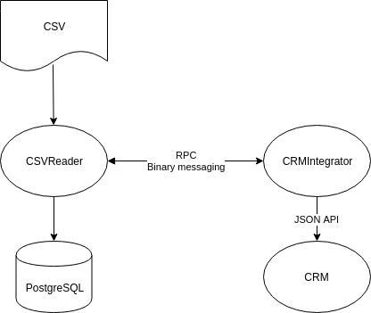
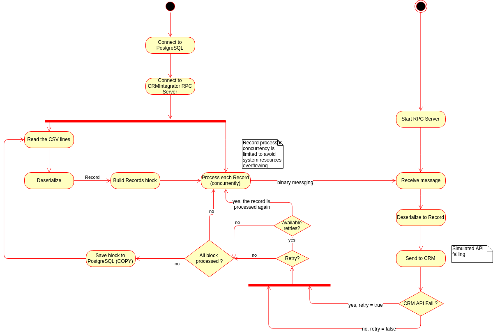

# Quiz
This is a solution scenario to this challenge:
```
Let’s assume we have a large csv file that contains the information of the
customers we work with. The CSV can be very large and the information will not
fit in the system memory. Once we have the data parsed we need to save it in
the database (Postgresql) and send this information to a CRM (Customer
Relation Management) service.
The CRM has a standard JSON API, but it is not very reliable and may fail
randomly. We need to make sure that we send the data to the CRM as quickly as
possible while ensuring we don’t send the same customer data to the CRM
system multiple times.
As we expect the application to grow, we split the project into two small services
the CSV reader and CRM integrator.

To use only go standard library is a requeriment, except for the posgresSQL driver
```


Enjoy !

# Architecture
There are two services, CSV Reader and CRM Integrator. Basically, the first one read the csv file in a stream, building blocks of records, which are processed concurrently. Each record in the block is tried to be sent to the CRM Integrator so, it sends  it to the CRM API. When the CSV Reader sends a record to the CRM Integrator, it do it synchronously, waiting for its response. The CRM Integrator tries to send the received record to the CRM JSON API. It can fails. If so, the CRM Integrator responds CSV Reader with a *error* or/and *retry=true*. Otherwise, it responds with *retry=false* or/and *error=nil*. Then,the CSV Reader  acts on that way: If *retry=false* and *error=nil* all is ok, nothing to do here. If *retry=true* or "error=nil*, it checks for available retries for the record. If there is ones, the record is sent again to the CRM Integrator. If not, the record is discarded and it will not be inserted in PostgreSQL.

I use blocks of records for performance purposes. On this way, it's make easy to insert the entire block in database, instead of to do an insert per each record. 

The records sending from the CSV Reader to the CRM Integrator is done by record. I also could be done by block. The change is really easy to do if you want do it ;-) I've left on this way to avoid an unnecessary overhead of complexity in the code. And I'm not sure about how much capacity the system would be increased.

 

# Infrastructure
To code the quiz I've used:
* Go go1.11.5: As a programming language
* Go mod: I've used modules as dependency management. ** NOTE: go mod does not put all dependencies in the vendor folder**
* Make: GNU Make 4.2.1
* PostgreSQL: I've used PostgreSQL as a storage. It's accessed for the repository layer only
* Docker 18.06.1-ce: Used to build a docker * image with the service
* Docker-compose 1.21.0: Used to start the * service as a docker container

# Design
As I alreday have explained above, this repo contains two services: CSVReader and CRMIntegrator. I also have explained how them acts. Here I'll explain you of what packages the services are composed, and what resource provides each of them

I’ve choosen to implement a simple architecture, but good enough to apply the SOLID principles. For example “Single Responsability” and "Interface Segregation"

## CSV Reader
This service is under the folder *csvreader*, and it's compose by the packages:

* *config*: Environment configuration loading
* *service*: CSV Reader service flux. Here it's implemented the logic for records process
* *reader*: CSV reading an deserializing to Record items
* *pkg/domain*: Bounded context domains
* *pkg/command*: Serialize/Deserialize code
* *repository*: Persistence layer. Coupled to PostgreSQL storage solution
* *db*: SQL script to create the records table. It's only necessary for non dockerized settings

## CRM Integrator
This service provides an integration with the CRM JSON API. Of course, this API has been simulated in the quiz.

* *config*: Environment configuration loading
* *rpc*: RPC Server
* *command*: Command to receive records, exposed by the RPC Server
* *service*: Abstraction layer over the CRM Integration
* *crm*: CRM Integration layer. It includes a random function to simulate CRM API failing 

# Building and execution of the quiz solution
I've added a *Makefile* file to faciitate this task, and the rest of tasks related to the repo.

**NOTE: You must use go 1.11 or higher if you try to build the code** Otherwise, you'll have to download the missing dependencies by yourself

Although you can compile and execute the services without Docker, for demostration purposes, I've added *Dockerfiles* files and a *docker-compose.yml* to make it easy. See the *Makefile* file for build the services locally. Here, I'll show you how to execute the quiz with *docker-compose*

## Building Docker images
```sh
make docker-build-crm
make docker-build-csv
``` 
## Execution of the quiz
The easiest way is do it using docker-compose. I recomend you use a splitable terminal, doing three panels, one to start the DB, another to start the CSV Reader and another to start he CRM Integrator.

### Fist of all, start the PostgreDB
```sh
make docker-db
``` 
### Second, start the CRM Integrator
```sh
make docker-crm-run
```
### Second, start the CRM Integrator
```sh
make docker-csv-run
```
That's it !!!

Theskyinflames.
